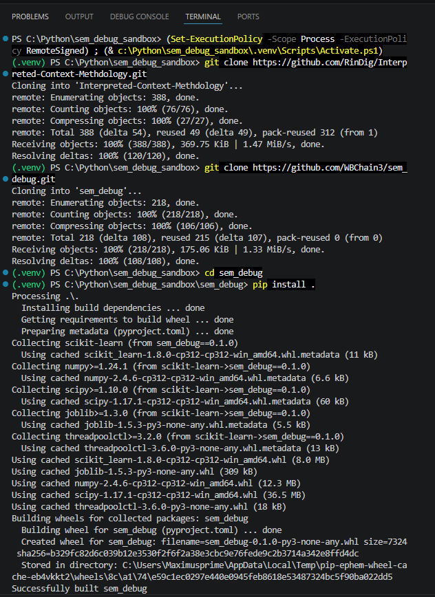
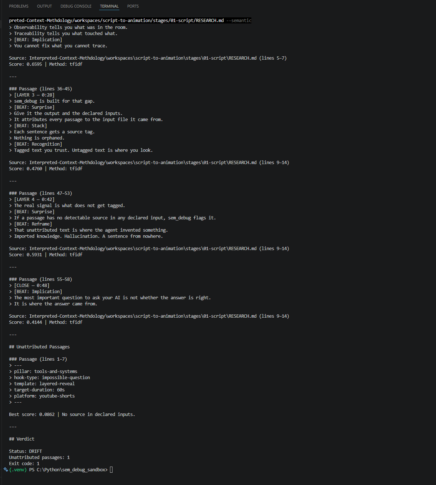

# sem_debug

Passage-level attribution tracer for AI pipeline outputs.

## What it does

sem_debug takes an output file and a set of declared input files. It maps each passage in the output back to its highest-scoring source. Passages with no detectable source are flagged as unattributed. Those are the signal: where the agent invented, hallucinated, or imported outside knowledge.

## The gap it fills

Van Clief's ICM (section 6.2) declares which files a stage was given. sem_debug answers which passage in the output came from which part of those files. ICM gives you observability. sem_debug adds traceability. Built in response to the semantic debugging gap identified in Van Clief and McDermott (2026), Interpretable Context Methodology, arXiv:2603.16021.

## Setup

You need two repositories. Set up your workspace like this:

```
your_workspace/
├── Interpreted-Context-Methdology/
└── sem_debug/
```

Step 1. Clone the ICM repo into your workspace folder.

```
git clone https://github.com/RinDig/Interpreted-Context-Methdology.git
```

Step 2. Clone sem_debug into the same folder.

```
git clone https://github.com/WBChain3/sem_debug.git
```

Step 3. Install sem_debug.

```
cd sem_debug
pip install .
```

Step 4. If you want semantic matching enabled, install the extras.

```
pip install -r requirements-semantic.txt
```

Note: the semantic install pulls torch and the sentence-transformers stack. Expect 300-400 MB and a few minutes depending on your connection.

Requires Python 3.8 or higher.



## Usage

Point sem_debug at a stage output file and the declared input files for that stage. Using the ICM folder structure:

```
sem_debug your_workspace/Interpreted-Context-Methdology/workspaces/your-workspace/stages/your-stage/output/output.md --inputs your_workspace/Interpreted-Context-Methdology/workspaces/your-workspace/stages/your-stage/RESEARCH.md
```

Common flags:

```
sem_debug output.md --inputs input1.md input2.md
sem_debug output.md --inputs input1.md --semantic
sem_debug output.md --inputs input1.md --report report.md
sem_debug output.md --inputs input1.md --strict
```

- `--inputs` — one or more input source markdown files.
- `--semantic` — enable semantic matching via sentence-transformers on TF-IDF failures.
- `--report FILE` — write markdown report to FILE instead of stdout.
- `--strict` — promote DRIFT to BLOCKED (exit code 2) when unattributed passages exist.
- `--stage LABEL` — stage label for the trace report.
- `--threshold N` — similarity threshold (default: 0.35).

Exit codes: 0 = CLEAN, 1 = DRIFT, 2 = BLOCKED.



## What to expect

CLEAN means every passage in the output traced back to a declared input. DRIFT means one or more passages had no detectable source. BLOCKED is DRIFT with --strict enforced, exits with code 2. The unattributed passages are the ones worth reading. They are where the agent went outside the declared context.

## What is coming next

sem_debug v0.1 is a single-stage snapshot tool. These are the natural next steps:

- Inline pipeline instrumentation. Call sem_debug as part of the stage run rather than after it.
- Multi-stage drift tracking. Compare attribution across iterations of the same stage, not just a single output.
- Zone-level threshold tuning. The current threshold is a single scalar. Different document types and pipeline stages need different values.
- Report integration. Link trace output back into the ICM stage context instead of writing to a separate file.

## Known Limitations

### Language and Environment Dependency

sem_debug requires Python 3.8 or higher. Windows console default encoding cannot display certain characters in terminal output. Use --report FILE to write correct UTF-8 output on Windows.

### Semantic Matching

The --semantic flag requires sentence-transformers and downloads the all-MiniLM-L6-v2 model on first use, approximately 80 MB from HuggingFace. The full semantic install including torch is 300-400 MB. Validated against a Zone 2 paraphrase fixture with real embeddings, score 0.4532, above the 0.35 attribution threshold. TF-IDF remains the default. Use --semantic when TF-IDF fails on paraphrase-heavy content.

### Single Stage Only

sem_debug traces one output file against a set of input files. It does not compare draft N against draft N+1, track temporal drift across iterations, or instrument pipelines. Each invocation is an independent snapshot.

### Attribution Is Best-Match, Not Causal

Output passages are linked to their highest-scoring input passage. When multiple inputs overlap, the tool picks one winner. It cannot distinguish faithful reproduction from accidental lexical overlap, and it cannot prove the agent read the input passage before writing the output. Attribution is heuristic proximity, not causal provenance.

### Semantic Validation Threshold

The --semantic path uses a cosine-similarity threshold of 0.45. The current validated score is 0.4532 (Zone 2 attributed, threshold passed). This threshold does not adapt per zone, per model, or per document length. Zone-level tuning is not yet implemented.